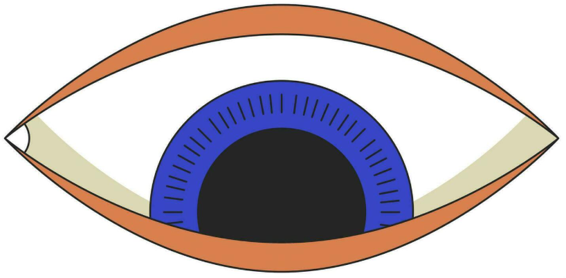
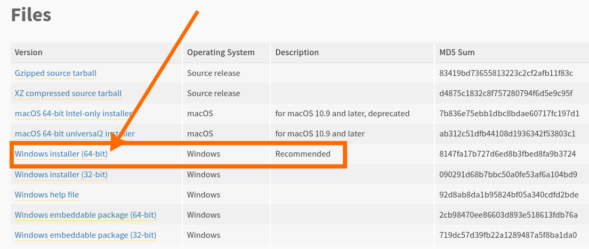

# Software: Python & CircuitPython

*"Python & CircuitPython are relatives."*

(*Father* :construction_worker:) - **Python** is simple text & made to be spoken. 

Python is **FREE**! **|** Has tons of FREE help **|** Python is very popular **|** Python doesn't use crazy symbols. 

- **But we'll need to install it.**

  Can you read this aloud? 

```
if number > 500:
   print('Your number is greater than 500.')
else:
   print('Your number is less than 500.')
```

You're on :fire: 

(*Baby* :baby:) - **CircuitPython** is used with NeoTrellis. 

We'll use **CircuitPython**!

---

### Step #1: Install Python 

<script> function button(){window.open("https://www.python.org/downloads/release/python-398");} </script>
<button onclick="button()">Go to Python.org and download Python 3.9</button>

<script> function button(){ window.open("address");} </script> 
<button onclick="button()">text</button>


|Step#| |
| :- | :- |
|1| '' |
|2|Scroll down to find **Windows installer (64 bit)** & Download:<br> |
|3||
|||
|||
|||


---

### Step #2: Install Thonny

Thonny is a Python **development environment** for beginners. Also called your **IDE.**

Thonny can help you write better code. 
It can help you by looking for any mistakes and can help you fix some too.

open up a python terminal window and enter:
**pip install thonny**

|Step#| |
| :- | :- |
|1| Go to: [Thonny](https://thonny.org/) |
|2| Download the Windows version. |
 
-There is a list of tutorials suitable for experienced programmers on the BeginnersGuide/Tutorials page.
-Online documentation is your first port of call for definitive information. There are simple, short tutorials and more complicated ones. Keep looking for whatever you like the best.


- CircuitPython is easy to use because all you need is that little board, a USB cable, and a computer with a USB connection.
 


-CircuitPython is almost-completely like Python. CircuitPython works with NeoTrellis hardware.

# CircuitPython

CircuitPython is a simplified version of Python. It works with microcontrollers. 

Simply copy and edit files on the flash drive named CIRCUITPY which appears when NeoTrellis is plugged into a computer to iterate.

The following instructions will show you how to install CircuitPython. If you've already installed CircuitPython but are looking to update it or reinstall it, the same steps work for that as well!
adafruit_products_TrellisM4_UF2_downloaded.png

Click the link above and download the latest UF2 file.

Download and save it to your desktop (or any folder).
adafruit_products_TrellisM4StatusLEDGreen.png

Plug your NeoTrellis M4 Express into your computer using a known-good USB cable.

A lot of people end up using charge-only USB cables and it is very frustrating! So make sure you have a USB cable you know is good for data sync.

Double-click the Reset button next to the USB connector on your board, and you will see the status DotStar RGB LED turn green. If it turns red, check the USB cable, try another USB port, etc.

If double-clicking doesn't work the first time, try again. Sometimes it can take a few tries to get the rhythm right!
adafruit_products_TRELM4BOOT.png
adafruit_products_TRELM4BOOT.png
adafruit_products_Drag_UF2_TrellisM4.png

You will see a new flash disk drive appear called TRELM4BOOT.

Drag the adafruit_circuitpython_etc.uf2 file to TRELM4BOOT.
adafruit_products_TrellisM4_CIRCUITPY.png

The LED will flash. Then, the TRELM4BOOT drive will disappear and a new disk drive called CIRCUITPY will appear.

That's it, you're on :fire:! 

You can then unzip this download and drag the files onto CIRCUITPY drive to get back to the default drum machine


## More TUTORIALS:

:+1:
[Abhijay's video playlist](https://www.youtube.com/playlist?list=PLVJIaQIN1-U7R3uJ16FP6xKWFEc6uZRee)
[Mr C. Loves W3Schools](https://www.w3schools.com/python/)
[Geeks 4 geeks](https://www.geeksforgeeks.org/python-programming-language-tutorial/)


:muscle:
[Prof G. is EXCELLENT but Hi-level](https://www.youtube.com/playlist?list=PLBJJ76R_ry5T3X72OIDkMOXQIdmcvSkue)

?
[Beginners](https://wiki.python.org/moin/BeginnersGuide)
[learnpython](https://www.learnpython.org/)
[FreeCodeCamp.org](https://www.freecodecamp.org/news/learn-python-free-python-courses-for-beginners/)
[Free courses](https://medium.com/javarevisited/10-free-python-tutorials-and-courses-from-google-microsoft-and-coursera-for-beginners-96b9ad20b4e6)
[Good ideas](https://www.freecodecamp.org/news/best-python-tutorial/)
[Free Youtube videos](https://www.youtube.com/playlist?list=PLBZBJbE_rGRWeh5mIBhD-hhDwSEDxogDg)
[](https://www.youtube.com/watch?v=St48epdRDZw)
[](https://pythonspot.com/beginner/)
[](https://www.pythonforbeginners.com/python-tutorial)
[](https://www.youtube.com/watch?v=t8pPdKYpowI)
