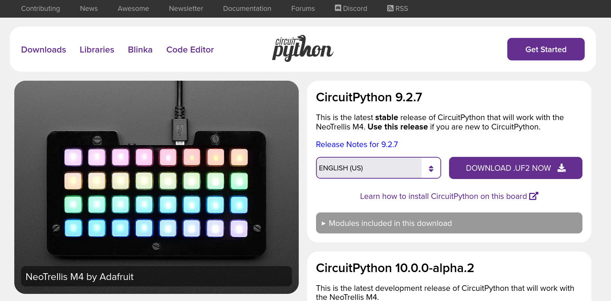

# Update the UF2 Bootloader

- Update the UF2 Bootloader (important)
- Updating Your Bootloader
  - **MAKE decision to update uf2 or not?**
  - Go to: https://circuitpython.org/board/trellis_m4_express/
  - 
  - To see your board, get the UF2 and load the boot file.
  - You need to double-click the reset button (quickly).
  - If you did this correctly, a text file will appear on your device (`INFO_UF2.TXT`).
  - Open `INFO_UF2.TXT` file.

You should see something like:
 ```
Adafruit CircuitPython 9.2.7 on 2025-04-01; Adafruit Trellis M4 Express with samd51g19
Board ID:trellis_m4_express
UID:09E09FE553324853202020471B390BFF
```

